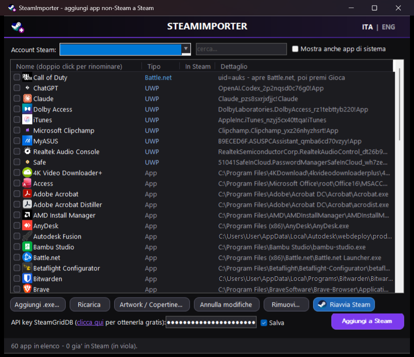

[English](README.md) | **Italiano**

# SteamImporter

Aggiungi alla libreria Steam app e giochi che non vengono da Steam — con icone,
artwork e la possibilità di annullare. Solo Windows, nessuna installazione, un
unico eseguibile portatile.



## Perché

Steam permette di aggiungere collegamenti esterni, ma non vede affatto le app
del Microsoft Store / Xbox (UWP), non conosce gli altri launcher di giochi e
non mette nessuna copertina. SteamImporter scansiona tutto quello che hai già
installato, scrive i collegamenti da solo e scarica le copertine da
[SteamGridDB](https://www.steamgriddb.com/).

## Cosa fa

**Trova le app da solo**

| Fonte | Note |
| --- | --- |
| Microsoft Store / Xbox / Game Pass (UWP) | avvio tramite `shell:AppsFolder` |
| Battle.net | apre il client sul gioco (vedi *Limiti noti*) |
| Epic Games | avvio silenzioso tramite il launcher Epic |
| GOG Galaxy | avvio diretto |
| Ubisoft Connect | avvio tramite `uplay://` |
| Programmi del menu Start | qualsiasi app Win32 installata |
| Qualsiasi altro `.exe` | scelto a mano |

**Artwork**

* Copertine, banner, hero e loghi scaricati in automatico da SteamGridDB
  (serve una API key gratuita).
* Una finestra **Artwork Manager** dove scegli tu ogni immagine dalle
  anteprime, con una barra di ricerca per quando il nome dell'app non trova
  nulla — comoda per le app che non sono giochi.
* Per le app UWP, se non c'è altro, viene usata l'icona contenuta nel pacchetto.

**Ti tiene lontano dai guai**

* Prima di ogni modifica a `shortcuts.vdf` viene fatto un backup (restano gli
  ultimi 10).
* **Annulla modifiche** torna indietro di un passo alla volta.
* Le app già presenti in libreria vengono segnalate e non vengono mai aggiunte
  due volte.
* **Rimuovi** toglie i collegamenti, artwork compresi.
* Steam viene chiuso con garbo (`-shutdown`) aspettando che esca davvero, con
  un avviso se c'è ancora un gioco aperto.

**Interfaccia**

Tema scuro con lo switch **ITA | ENG** in alto a destra; la scelta viene
ricordata.

## Requisiti

* Windows 10 o 11
* Steam
* PowerShell 5.1 — è già dentro Windows, non c'è niente da installare
* Una [API key di SteamGridDB](https://www.steamgriddb.com/profile/preferences/api)
  gratuita, se vuoi gli artwork

## Uso

1. Avvia `SteamImporter.exe` (oppure `Avvia SteamImporter.bat` per lanciare
   direttamente lo script).
2. Scegli in alto il tuo account Steam.
3. Spunta le app che vuoi; con un doppio clic sul nome puoi rinominarle.
4. Facoltativo: incolla in basso la tua API key di SteamGridDB.
5. Premi **Aggiungi a Steam**. Mentre la libreria viene scritta Steam deve
   essere chiuso — l'app si offre di farlo per te.
6. Premi **Riavvia Steam** per vedere il risultato.

## Limiti noti

* **I Call of Duty moderni (e gli altri titoli Battle.net) non si possono
  avviare direttamente.** Il gioco pretende un token di sessione che il client
  Battle.net passa solo quando premi *Gioca*; lanciando tu l'eseguibile si
  ottiene `BLZBNTBGS7FFFFF01 - "Credenziali di accesso non valide. Avvia sempre
  il gioco utilizzando l'app Battle.net."` Per questo il collegamento apre
  Battle.net e da lì premi Gioca. `--exec="launch <uid>"`, `battlenet://<uid>`
  e `--game=<uid>` sono stati provati tutti e non avviano proprio nulla.
* **Le app UWP** partono tramite `explorer.exe`, quindi l'overlay di Steam
  potrebbe non agganciarsi e il tempo di gioco potrebbe non essere contato. È
  un limite di Windows che vale per tutti gli strumenti che fanno questa cosa,
  non solo per questo.
* **Le barre di scorrimento restano chiare** nel tema scuro: Windows le scurisce
  solo tramite API non documentate, che questo strumento sceglie di non usare.
* I titoli Game Pass richiedono comunque l'app Xbox e un abbonamento attivo.

## Compilare l'eseguibile

`SteamImporter.exe` è un piccolo avviatore in C# con lo script e l'icona
incorporati, quindi funziona da solo. Per ricompilarlo dopo aver modificato lo
script:

```
Ricompila EXE.bat
```

Se `SteamImporter.ps1` si trova accanto all'eseguibile viene usato direttamente:
mentre sviluppi le modifiche si provano subito, senza ricompilare.

## Test

Un test automatico senza interfaccia controlla il CRC32, la lettura e scrittura
del formato VDF binario (compresa la riscrittura byte per byte del tuo
`shortcuts.vdf` reale), gli scanner e l'estrazione delle icone, senza toccare
la libreria:

```
powershell -ExecutionPolicy Bypass -File SteamImporter.ps1 -SelfTest
```

## Come funziona

Steam salva i collegamenti esterni in un file VDF binario in
`userdata\<account>\config\shortcuts.vdf`. SteamImporter implementa
direttamente quel formato (lettura e scrittura), calcola lo stesso app id che
Steam usa per i nomi dei file degli artwork (`crc32(exe + nome) | 0x80000000`)
e mette le immagini in `config\grid`.

## Licenza

MIT — vedi [LICENSE](LICENSE).
