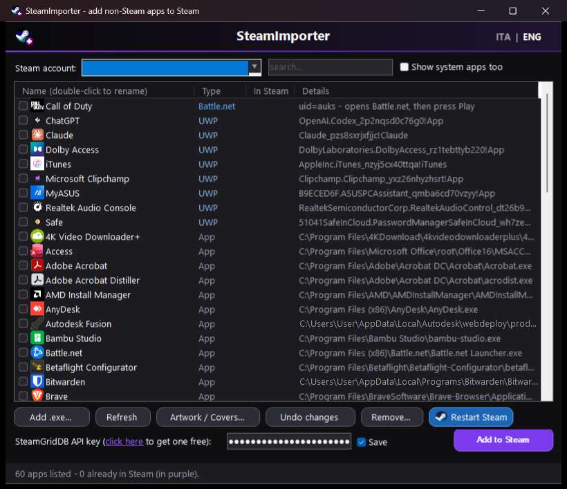

# SteamImporter

Add non-Steam apps and games to your Steam library — with icons, artwork and a
proper undo. Windows only, no installation, single portable executable.



## Why

Steam can add non-Steam shortcuts, but it cannot see Microsoft Store / Xbox
(UWP) apps at all, it does not know about your other game launchers, and it
gives you no artwork. SteamImporter scans everything you already have
installed, writes the shortcuts itself, and fetches covers from
[SteamGridDB](https://www.steamgriddb.com/).

## What it does

**Finds your apps automatically**

| Source | Notes |
| --- | --- |
| Microsoft Store / Xbox / Game Pass (UWP) | launched through `shell:AppsFolder` |
| Battle.net | opens the client on the game (see *Known limits*) |
| Epic Games | silent launch through the Epic launcher |
| GOG Galaxy | direct launch |
| Ubisoft Connect | `uplay://` launch |
| Start menu programs | any installed Win32 app |
| Any other `.exe` | picked manually |

**Artwork**

* Covers, banners, heroes and logos downloaded automatically from SteamGridDB
  (needs a free API key).
* An **Artwork Manager** window where you pick each image yourself from
  thumbnails, with a search box for when the app name finds nothing —
  handy for non-game apps.
* UWP apps fall back to the icon shipped inside the package.

**Keeps you out of trouble**

* Every write to `shortcuts.vdf` is preceded by a backup (last 10 kept).
* **Undo changes** walks back one step at a time.
* Apps already in your library are marked, and never added twice.
* **Remove** lets you take shortcuts out again, artwork included.
* Steam is asked to close politely (`-shutdown`) and waited for, with a warning
  if a game is still running.

**Interface**

Dark theme with an **ITA | ENG** switch in the top-right corner; the choice is
remembered.

## Requirements

* Windows 10 or 11
* Steam
* PowerShell 5.1 — already part of Windows, nothing to install
* A free [SteamGridDB API key](https://www.steamgriddb.com/profile/preferences/api)
  if you want artwork

## Usage

1. Run `SteamImporter.exe` (or `Avvia SteamImporter.bat` to run the script
   directly).
2. Pick your Steam account at the top.
3. Tick the apps you want, rename them by double-clicking if you like.
4. Optional: paste your SteamGridDB API key at the bottom.
5. Press **Add to Steam**. Steam must be closed while the library is written —
   the app offers to do it for you.
6. Press **Restart Steam** to see the result.

## Known limits

* **Modern Call of Duty (and other Battle.net titles) cannot be launched
  directly.** The game demands a session token that only the Battle.net client
  passes when you press *Play*; launching the executable yourself fails with
  `BLZBNTBGS7FFFFF01 - "Invalid login credentials. Always launch the game using
  the Battle.net app."` So the shortcut opens Battle.net and you press Play
  there. `--exec="launch <uid>"`, `battlenet://<uid>` and `--game=<uid>` were
  all tested and launch nothing at all.
* **UWP apps** are started through `explorer.exe`, so the Steam overlay may not
  attach and playtime may not be tracked. This is a Windows restriction and
  affects every tool that does this, not just this one.
* **Scrollbars stay light** in the dark theme: Windows only themes them through
  undocumented APIs, which this tool deliberately does not call.
* Game Pass titles still need the Xbox app and an active subscription.

## Building the executable

`SteamImporter.exe` is a small C# launcher with the script and icon embedded, so
it runs standalone. To rebuild it after changing the script:

```
Ricompila EXE.bat
```

If `SteamImporter.ps1` sits next to the executable it is used directly, which
makes testing changes immediate — no rebuild needed while developing.

## Testing

A headless self-test checks the CRC32, the binary VDF reader/writer (including a
byte-for-byte rewrite of your real `shortcuts.vdf`), the scanners and the icon
extraction, without touching your library:

```
powershell -ExecutionPolicy Bypass -File SteamImporter.ps1 -SelfTest
```

## How it works

Steam keeps non-Steam shortcuts in a binary VDF file at
`userdata\<account>\config\shortcuts.vdf`. SteamImporter implements that format
directly (reader and writer), computes the same app id Steam uses for artwork
file names (`crc32(exe + name) | 0x80000000`), and drops the images into
`config\grid`.

## License

MIT — see [LICENSE](LICENSE).

---

## In breve (italiano)

SteamImporter aggiunge alla libreria Steam le app che Steam non vede: giochi e
app del Microsoft Store / Xbox / Game Pass, giochi di Battle.net, Epic, GOG e
Ubisoft, i programmi del menu Start e qualsiasi `.exe`. Scarica anche
copertine e artwork da SteamGridDB, con una finestra dedicata per sceglierli a
mano.

Ogni modifica alla libreria passa da un backup e si può annullare. L'interfaccia
ha lo switch **ITA | ENG** in alto a destra.

Istruzioni dettagliate in italiano: [LEGGIMI.txt](LEGGIMI.txt).
